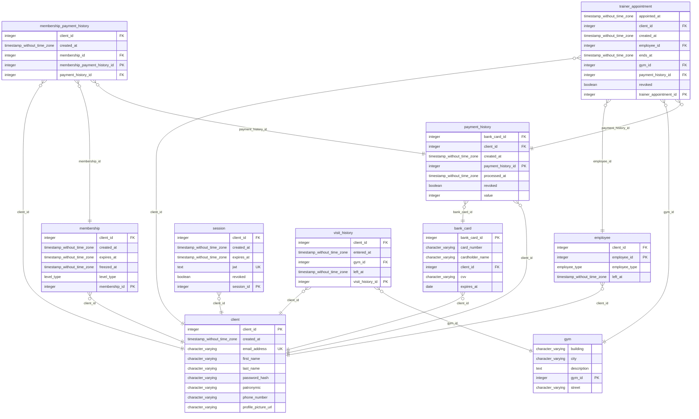

> [!CAUTION]
> This API is not intended for public use. It can serve as an example usage of [storona](https://storona.domin.pro) in production.

# Contents

- [Introduction](#introduction)
- [Prerequisites](#prerequisites)
  - [Bun](#bun)
  - [Node](#node)
  - [Database](#database)
  - [Auth](#auth)
  - [ERD](#erd)
- [Getting started](#getting-started)
  - [Bun](#bun-1)
  - [Node](#node-1)

# Introduction

This is a monolithic modern backend API that implements CRUD operations for a made up "Gym" project.

This API was designed as a smaller but full-fledged barebones express project without the use of any meta framework for extra abstraction. Instead it implements own architecture I'm fond of. Simplicity and flexibility are key to the project.

- [x] 📚 OpenAPI Specification
- [x] 📝 TSDoc Coverage
- [x] 🗂️ Database Repositories
- [x] 📖 ER Diagram
- [ ] 🖼️ AWS S3 Support
- [x] 🔍 Linting
- [x] ⚡ Bun Integration
- [x] 🪢 Backwards Node.js Compatibility
- [ ] 🚀 CI/CD
- [ ] 🧪 Complete Test Coverage



> [!TIP]
> For OpenAPI documentation, head to /docs page of deployed API instance whether it is localhost or production one.

# Prerequisites

Current prerequisite scripts are only suitable if you run x86-64 linux machine. For other platforms, refer to corresponding tech docs for installing prerequisites.

Either use [bun](https://bun.sh/) **OR** [node](https://nodejs.org/) to run this API, preferably `bun` as it is much faster, however both are supported.

### Bun

To install bun, use following curl:

```bash
$ curl -fsSL https://bun.sh/install | bash
```

### Node

To install node, use following script used to install fnm for managing multiple node versions:

```bash
$ curl -fsSL https://fnm.vercel.app/install | bash
$ source ~/.bashrc
$ fnm use --install-if-missing 20
```

### Database

Project uses PostgreSQL database along with [Kysely](https://kysely.dev/) query builder.

To work with test database, you need to have `psql` preinstalled on your machine:

```bash
$ apt install postgresql
```

Along with that fill in `DATABASE_URL` environment variable.

### Auth

Authentication requires no additional setup, just the `SALT` environment variable.

### ERD

If you want to generate ERD diagram, you need to install [mermerd](https://github.com/KarnerTh/mermerd) to pull database schema from an already migrated database.

For that, install Golang and run `go install github.com/KarnerTh/mermerd@latest`:

```bash
$ wget https://go.dev/dl/go1.23.2.linux-amd64.tar.gz
$ tar -C /usr/local -xzf go1.23.2.linux-amd64.tar.gz
$ export PATH=$PATH:/usr/local/go/bin
$ rm -f go1.23.2.linux-amd64.tar.gz
$ go install github.com/KarnerTh/mermerd@latest
```

Now you can run `bun erd:types` to pull changes to `public/erd.mmd` path. For that you only need to type connection string prompted by mermerd.

To export to graphic format, run `bun erd:up`.

# Getting started

For node and bun runtimes, you can use following commands to install dependencies and start the API:

### Bun

```bash
$ bun i
$ bun start
```

### Node

```bash
$ npm i -g pnpm
$ pnpm i
$ pnpm start:node
```
